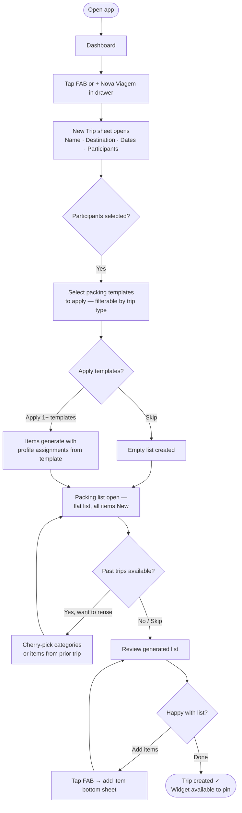
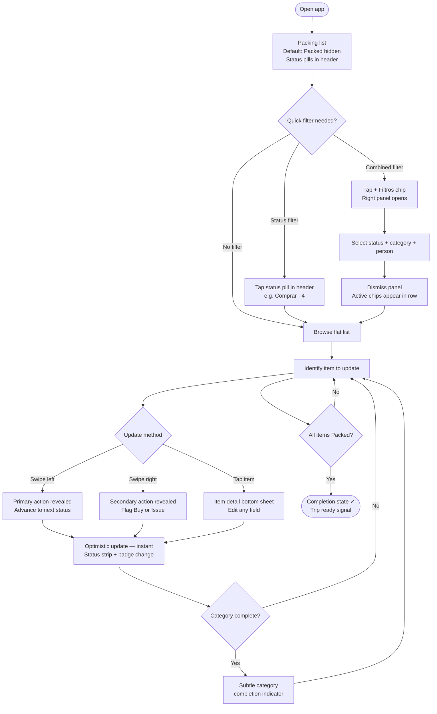
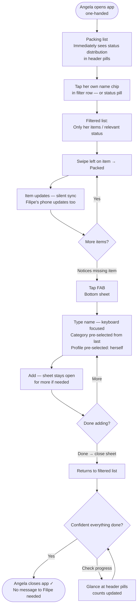
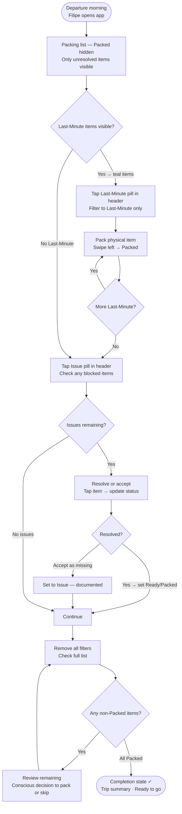

# UX Design Specification — FamilyHub

**Author:** Filipe
**Date:** 2026-03-24

---

<!-- UX design content will be appended sequentially through collaborative workflow steps -->

## Executive Summary

### Project Vision

FamilyHub is a private family management app designed for one household. The UX is not optimised for discoverability or onboarding — this family knows what the app does. Every interaction should feel like a shortcut, not a workflow. The measure of UX success is Angela using the app willingly, without prompting.

V1 UX scope is exclusively the Vacation module: packing list management, booking task tracking, template application, profile assignment, and real-time collaborative editing.

### Target Users

**Filipe — Primary Admin**
Power user, daily driver. Uses the app across contexts: planning mode (desktop posture, building a trip months out), preparation mode (last 3 days before departure, rapid-fire status updates), and offline mode (on a plane, no connectivity). Expects the app to be fast and direct — no confirmation dialogs, no extra taps.

**Angela — Co-Admin**
Symmetric partner. Uses the app in contribution mode: filtering by a specific family member's items, ticking things as packed, adding forgotten items. Must be able to do this one-handed, in the middle of doing something else (packing a bag, in the kitchen). Her UX test: "does this feel easier than sending Filipe a message?"

### Key Design Challenges

**1. Two interaction modes on the same screen**
Packing list serves both long-horizon planning (status: New, months out) and last-minute execution (status: Last-Minute, morning of departure). The same list must feel approachable in both states without mode-switching or complex UI.

**2. Real-time sync that stays invisible**
When Angela ticks items on her phone, Filipe's list must update without visual disruption. The sync mechanism must feel like the list is just always correct — not like something is "refreshing." Optimistic UI updates are critical here.

**3. Configuration without IT-software feel**
Categories, tags, and templates have significant setup depth. This must feel like customising a personal tool, not configuring enterprise software. No wizards, no required fields, no onboarding pressure.

**4. Offline state — confidence without feedback noise**
When offline, users must feel confident their changes are saved. But we can't add noise (spinners, sync banners) that interrupt the packing flow. The offline state should be as silent as the online state.

### Design Opportunities

**1. Packing status as a visual language**
Six statuses (New, Buy, Ready, Issue, Last-Minute, Packed) can be given a strong colour and icon identity that makes the state of a trip immediately scannable. A glance at the list should communicate "almost done" or "several things need buying" without reading a single word.

**2. Status-first filtering with composable category and person dimensions**
Status is the anchor filter — the primary mental model is "show me what's not done yet." Category and person are secondary dimensions stacked on top. With 50+ items, the default view is likely "hide Packed, show everything else." Full filter combinations must be reachable with minimal taps: status alone, status + category, status + category + person, category alone, category + person, person alone.

**3. Dashboard widget as family context signal**
The pinnable vacation widget has an opportunity to act as a living status summary — tasks sorted by urgency, packing progress at a glance — that tells both admins where the trip stands without opening the app.

---

## Core User Experience

### Defining Experience

The defining action for FamilyHub V1 is **the packing item status update** — moving an item from its current state to the next (New → Buy → Ready → Packed, or flagging as Issue). This is the action both admins will perform dozens of times per trip, on their phones, in the middle of doing something else.

The defining *moment* — the one that creates the "this is better than before" feeling — is the **first template application at trip creation**: Filipe selects participants, applies "Beach Family" + "Essential Documents", and sees a complete, person-assigned list appear instantly. Everything that was previously rebuilt from scratch is already there.

### Platform Strategy

- **Primary platform:** Android, touch-only, portrait orientation
- **Interaction model:** One-handed use is a design requirement. Angela packs a bag while using this app. Filipe ticks items at the supermarket. Thumb reach and single-tap interactions are the constraint.
- **Offline:** Offline-first is not a feature — it is the platform. The app must behave identically whether connected or not. No "offline mode" badge, no sync spinners. Just the list, always correct.
- **Screen real estate:** Mobile viewport only. No desktop consideration for V1. Dense lists (packing items) must be readable and actionable without scrolling past useful content.

### Effortless Interactions

These must require zero thought and minimal taps:

- **Status change:** A single tap or swipe on an item changes its status. No opening a detail screen, no dropdown, no save button.
- **Status-first filtering:** Status is the anchor filter dimension — reachable in one tap without opening a filter panel. The default active view hides Packed items ("show me what's left"). Category and person are stacked on top as secondary dimensions. Full filter combinations supported: status alone, status + category, status + category + person, category alone, category + person, person alone. Active filters shown as dismissible chips; removing a chip drops that dimension.
- **Adding an item:** A persistent "+" action opens a bottom sheet — not a new screen. Name, category, profile assignment. Defaults carry forward from the last item added. Done in under 5 seconds.
- **Real-time sync:** Another admin's changes appear on-screen silently. No refresh pull, no toast notification, no visual disruption. The list is just current.

### Filter Priority Reference

| Filter type | Frequency | Mental model |
|---|---|---|
| Status alone | High | "Show me everything still to Buy / not Packed" |
| Status + Category | High | "What Toiletries still need to be bought?" |
| Status + Category + Person | High | "What hasn't Aurora packed in Essentials?" |
| Category + Person | High | "What's Aurora's full kit?" |
| Category alone | Medium | "Review everything in Documents" |
| Person alone | Medium | "Review everything assigned to Isabel" |

### Critical Success Moments

**Moment 1 — Template application at trip creation**
Filipe creates the Algarve trip, selects all four participants, applies two templates. The packing list fills automatically with correctly assigned items (Isabel's diapers, Filipe's t-shirts, family sunscreen). This is the first time packing list preparation takes under 30 seconds instead of 30 minutes.

**Moment 2 — Silent real-time collaboration**
Angela ticks 5 items and adds one new one. Filipe's phone updates without him doing anything. No message sent, no coordination needed. The list is just current on both phones.

**Moment 3 — Departure morning**
All Last-Minute items flip to Packed. The list is complete. The family leaves knowing nothing was forgotten.

**Moment 4 — Offline on the plane**
Filipe opens the app in airplane mode. It loads instantly. He marks the last three items Packed. No error, no spinner, no "no connection" message.

### Experience Principles

**1. One tap, not one workflow**
Every common action — status change, filter activation, item add — completes in a single interaction. If a flow requires more than two taps for a routine action, the design has failed.

**2. The list is always correct**
Sync and offline state are invisible. There is no "refreshing," no sync indicator during normal use. The user never wonders if what they see reflects reality.

**3. Built for interruption**
Angela is packing a bag. Filipe is at the supermarket. The UI must be fully usable one-handed, present its most important information without scrolling, and be resumable instantly from wherever the user left off.

**4. Confidence over confirmation**
No "are you sure?" dialogs for common actions. Changes apply immediately. Undo is a swipe gesture — not a modal interrupt.

**5. Visual status language over text labels**
The six packing statuses communicate their meaning through colour and icon, not just text. A user should be able to read the state of a trip list in three seconds without reading any words.

---

## Desired Emotional Response

### Primary Emotional Goals

**Calm control, not anxious preparation.**
When Filipe opens the packing list, the dominant feeling must be "I know where everything stands" — not "I hope I haven't forgotten something." The app's job is to convert pre-trip anxiety into calm organisation. If it adds any cognitive load, it has failed.

**Relief, not effort.**
Angela's adoption depends on the app feeling like it reduces her work — not that it creates a new obligation ("I have to update the app too"). Every interaction she makes should feel like one less thing to mentally track, not one more thing to do.

**Trust without verification.**
The list is correct. Neither admin should ever feel the need to cross-reference it against reality, pull to refresh, or ask "did you update the app?" The feeling of trust in the data is the silent backbone of the whole experience.

### Emotional Journey Mapping

| Stage | Target feeling | Risk to avoid |
|---|---|---|
| Trip creation + template applied | Anticipation + relief ("it's already done") | Overwhelm from empty list or too many options |
| Planning phase (months out) | Calm control — tasks visible, deadlines clear | Forgetting the app exists / low engagement |
| Packing phase (last 3 days) | Focus + momentum — each item Packed is a small win | Anxiety from a long undifferentiated list |
| Departure morning | Confidence + satisfaction — nothing forgotten | Last-minute panic from an unclear status |
| Offline on the plane | Implicit trust — not even thinking about connectivity | Doubt ("did that save?") |
| Angela's first real-time sync | "We're in sync" — collaborative warmth | "The app is doing something" (tech-forward, not family-forward) |

### Micro-Emotions

- **Confidence over confusion** — status labels and filter state must always be unambiguous
- **Accomplishment over frustration** — ticking an item to Packed should feel like a small, satisfying win; visual feedback matters
- **Trust over scepticism** — no stale data warnings, no "last synced X minutes ago" during normal use
- **Calm over anxiety** — the default list view (active items only, Packed hidden) should reduce visual noise, not increase it
- **Warmth over utility** — this is a family app; profile names and avatars should make it feel personal, not enterprise

### Design Implications

| Target feeling | UX design approach |
|---|---|
| Confidence / Trust | Optimistic UI updates — item status changes instantly on tap, no "saving..." indicator. Silent sync during normal use. |
| Accomplishment | Per-category or per-person progress indicators (e.g., "5/8 packed"). Visual feedback on status change (subtle animation). |
| Calm | Default view = Packed items hidden. Filter state clearly communicated but not visually dominant. Clean layout, no notification noise in V1. |
| Relief at template application | Visual moment when items populate from template — items appear with profile assignments visible. |
| Warmth | Profile avatars used as filter controls and item attribution. Family member names in Portuguese throughout. Colour palette warm, not clinical. |
| "In sync" collaboration | Real-time updates appear as natural list changes — no banner, no toast, no "Angela just updated this." The list is just current. |

### Emotions to Avoid

- **Anxiety:** "Did this save?", "Is the list up to date?", "Did the sync work?"
- **Obligation:** "I have to open the app and update it." The app should feel like a shortcut, not a chore.
- **Overwhelm:** Opening a 50+ item list with no orientation. The status-first filter default addresses this directly.
- **Distrust:** Any state where the user isn't sure if the data is correct. This is the most damaging possible failure.

---

## UX Pattern Analysis & Inspiration

### Inspiring Products Analysis

**Vivino**
The core UX achievement: a dense wine card that communicates everything relevant (name, vintage, rating, region, price tier) at a glance without opening it. The personal cellar view makes a large collection feel organised and personal — it feels like *your* wine, not a generic database. Per-user ratings shown alongside community data make it inherently personal.

*Relevance to FamilyHub:* Packing item cards need the same "scannable at a glance" quality — status colour, category icon, assigned profile, quantity all readable without tapping. The personal collection warmth is the tone FamilyHub needs.

**Gmail**
The single most transferable pattern: **swipe-to-action**. Swipe left = primary action (instant, colour-revealed, reversible). Swipe right = secondary action. Filter chips appear as a scrollable row above the list — one tap activates, one tap removes. The "inbox zero" visual payoff mirrors the "all items Packed" departure state.

*Relevance to FamilyHub:* Swipe-to-action is the right pattern for packing item status changes. The "inbox zero" reward = the trip completion state on departure day.

**Miio (EV charging app)**
Charging point tiles communicate state purely through colour and icon — no text needed to know if a charger is available, in use, or faulted. One-tap start. Location-based grouping organises points exactly as categories organise packing items.

*Relevance to FamilyHub:* The tile colour-state model is the right pattern for packing item status visualisation. Status = colour + icon, readable instantly. Category sections = location groups.

**Your previous OutSystems app (direct predecessor)**
The prior app established a validated navigation model: left drawer for global navigation, a context-sensitive bottom bar that surfaced the 3–4 most relevant actions for the current screen, and a right-side filter panel for full filter composition. On the packing list screen specifically — Add item, list view, "not packed" quick filter, progress summary — proved that surfacing the most common actions at thumb level dramatically reduces friction. The right-side filter panel kept the main list clean while preserving full combinatorial filter power (any combination of category + person + status).

*Relevance to FamilyHub:* This navigation model is validated by real family usage and directly informs V1 design. The "not packed" quick filter as a persistent bottom bar action answers the status-first filtering requirement. The right panel for full combination filtering is the right separation of concerns — fast for common cases, powerful for complex ones.

**Amazon Alexa (Lists) — Studied as Anti-Pattern**
Alexa's shared lists are frustrating: flat structure with no categories, no item attributes beyond name, no filtering, sync that surfaces its own mechanics, and voice entry that creates naming inconsistencies.

*Relevance to FamilyHub:* Every frustration from Alexa lists is a direct design requirement — rich item attributes, category organisation, multi-dimensional filtering, invisible sync.

### Transferable UX Patterns

**Swipe-to-action (Gmail)**
Left swipe on a packing item reveals the primary status action (advance to next status or mark Packed). Right swipe reveals a secondary action (flag as Buy or Issue). Colour-coded action reveal. Instant, reversible, no modal.

**Context-sensitive bottom bar (previous app)**
Bottom bar adapts to the current screen. On the packing list: (1) Add item — primary action, large; (2) Full list link; (3) "Not packed" quick filter shortcut — one tap, always visible; (4) Progress summary quick-link. The "not packed" shortcut is the single most frequent filter action and must be one tap in the bottom bar.

**Right-panel filter (previous app)**
Full combinatorial filter power accessible via right-side panel or drawer: any combination of status + category + person. Keeps the main list chrome clean. Active filters shown as dismissible chips above the list. Opening the panel does not navigate away from the list.

**Scannable item cards (Vivino)**
Each packing item card: item name prominent, status colour as left border, category icon secondary, profile avatar small, quantity inline. All readable at list density without tapping.

**Colour + icon state language (Miio)**
Fixed colour and icon per status: New = grey, Buy = amber, Ready = blue, Issue = red, Last-Minute = orange, Packed = green. Instantly recognisable without reading labels.

**Left drawer global navigation (previous app)**
Left drawer for module-level navigation and global settings. Keeps the main screen clean. In V1 this is simpler (fewer modules) but establishes the pattern for V2–V6 expansion.

**Completion state payoff (Gmail inbox zero)**
When all items in a category or the whole trip reach Packed, a visual completion state signals success — not just an empty list, but a positive moment. Mirrors departure day confidence.

### Anti-Patterns to Avoid

- **Flat unorganised lists (Alexa)** — no categories, everything in one pile
- **Surfaced sync mechanics (Alexa)** — "list updated" notifications; sync is invisible in FamilyHub
- **Modal status changes** — opening a detail screen just to change status; swipe-to-action replaces this
- **No default filtering** — presenting 50+ items with no orientation; Packed-hidden default addresses this
- **Generic onboarding pressure** — forcing setup flows before the app is usable

### Design Inspiration Strategy

**Adopt directly:**
- Swipe-to-action for status changes (Gmail)
- Status count pills in header as quick-filter toggles (D2 header pattern)
- Right-panel full combinatorial filter — any combination of status + category + person (previous app)
- Left drawer for global navigation (previous app)
- Colour + icon as primary status language (Miio)
- Floating FAB as the sole persistent action control

**Adapt:**
- Vivino's rich card density → adapted for packing item scannability (fewer data points, same principle)
- Miio's grouped tile view → adapted as collapsible category sections in the packing list
- Gmail's filter chips → used as active filter indicators above the list, populated from the right panel
- Per-trip progress summary accessible as a bottom bar quick-link

**Avoid:**
- Any interaction that surfaces the sync layer (Alexa anti-pattern)
- Modal dialogs for routine status changes
- Flat lists without organisation or filtering

---

## Design System Foundation

### Design System Choice

**Material Design 3 (Material You)** — implemented natively in Flutter or via `react-native-paper` on React Native/Expo, depending on framework selection.

### Rationale for Selection

- Zero dependency overhead on Flutter; minimal on React Native (`react-native-paper` is the de facto M3 implementation)
- Dynamic color system generates the full light + dark palette from a single warm seed colour — personal, family-warm aesthetic without custom design work
- Every identified navigation pattern (left drawer, bottom bar, right side sheet, bottom sheet, filter chips, FAB) is a first-class M3 component
- Dark mode follows Android system preference out of the box
- Accessibility (touch targets, contrast, screen reader) handled by the system
- Well-documented, large community, long-term maintained by Google
- Appropriate for a solo developer building incrementally across 6+ versions

### Implementation Approach

- Set a warm seed colour at the theme root; M3 generates all surface, container, and content colours automatically
- Use `NavigationDrawer` for left global navigation
- Use `SideSheet` or right-anchored `ModalDrawer` for the filter panel
- Use `BottomSheet` for the quick-add item form
- Use `FilterChip` for active filter indicators
- Use `Card` for packing item rows
- Implement swipe-to-action as a single custom component using platform gesture APIs (the only bespoke component needed in V1)

### Customization Strategy

- **Seed colour:** Warm palette (family-forward, not clinical). Candidates: soft coral, Mediterranean terracotta, warm teal — to be decided
- **Typography:** M3 type scale with readable body size for dense lists (body-medium at minimum 14sp)
- **Iconography:** Material Symbols (variable font, filled variant for active states, outlined for inactive)
- **Status colours:** Custom semantic colours layered on top of M3 palette — the six packing statuses each get a fixed colour that works in both light and dark mode: New = grey, Buy = amber, Ready = blue, Issue = red, Last-Minute = teal, Packed = green

---

## Defining Experience

### 2.1 Defining Experience

FamilyHub's defining experience is **the packing list status loop**: the family member opens the packing list, immediately sees only the items still requiring action (Packed items hidden by default), applies a filter if needed to narrow focus, and updates item statuses with a swipe or tap. They close the app. The other admin's phone is already up to date.

If this loop takes more than three seconds per item, the design has failed. If either admin ever wonders whether the list reflects reality, the design has failed.

**In one sentence:** *"See what needs doing → swipe to resolve → trust it's done."*

### 2.2 User Mental Model

Users approach packing with two distinct mental modes:

**Planning mode** (months out): "What do I need to organise?" Items are New or flagged for future action. The mental model is a checklist being built, not executed. Density and overview matter more than speed.

**Execution mode** (last 3 days): "What's left to do right now?" Items are being moved through Buy → Ready → Packed rapidly. Speed and one-handed operation dominate. The mental model is triage — process the outstanding pile as fast as possible.

**Current solution pain:** WhatsApp messages, Notes apps, or rebuilt lists before each trip. The frustration is starting from zero every time and having no shared, live view. Angela doesn't know what Filipe already packed. Nobody knows how close they are to done.

### 2.3 Success Criteria

- **Speed:** Updating an item's status takes one gesture (swipe) — under 1 second including feedback
- **Orientation in <3 seconds:** Opening the list communicates immediately how many items are left and what categories still need work — without reading anything
- **Filter in <2 taps:** Reaching "show me all Buy items in Toiletries" takes at most 2 taps from the main list view
- **Silent sync:** Angela's update appears on Filipe's screen without any notification, banner, or visual disruption
- **Departure confidence:** On departure morning, a clear visual state communicates "all done" or "X items still unresolved"

### 2.4 Novel vs. Established Patterns

FamilyHub uses **established patterns combined in a validated way** (from the previous app). No novel interaction design is required — users will need zero education.

| Pattern | Source | Status |
|---|---|---|
| Swipe-to-action | Gmail, iOS Mail | Established — users know it |
| Context-sensitive bottom bar | Previous app, many mobile apps | Established — validated in prior build |
| Right-panel filter drawer | Previous app | Established — validated in prior build |
| Filter chip row (active state) | Gmail, Google Maps | Established — immediately learnable |
| FAB for primary add action | Material Design | Established |
| Left navigation drawer | Material Design | Established |

The only non-trivial element: the **composable multi-dimension filter** (status + category + person simultaneously). It behaves like any multi-select filter system but the right-panel interaction must make the active state and reset path immediately clear.

### 2.5 Experience Mechanics — The Status Update Loop

**1. Initiation**
User opens vacation → navigates to packing list. Default state: Packed items hidden. Active filter from previous session is remembered and shown as chip(s) in the filter row.

**2. Orientation**
Before any interaction, the user sees: a flat list of items (not grouped), each item showing name + status colour strip + status badge + category + profile. Status count pills in the header communicate the distribution at a glance. Remaining non-Packed item count visible.

**3. Filtering**
- **Fast path (status):** Tap a status count pill in the header → instantly activates that status as a filter chip. Tap again to remove. One tap.
- **Power path:** Tap "+ Filtros" chip → right panel opens. Select any combination of status + category + profile chips. Active selections highlighted. Dismiss panel → active filters appear as dismissible chips in the filter row above the list.

**4. Status Update**
- **Swipe left** → reveals primary action (advance to next logical status, colour-coded). Release to confirm. Instant optimistic update.
- **Swipe right** → reveals secondary action (flag as Buy or Issue, context-dependent).
- **Tap item** → opens item detail bottom sheet for editing fields, reassigning profile, changing category or quantity.

**5. Feedback**
- Status change: item colour/icon updates instantly. Last item in a category reaching Packed triggers a subtle category completion indicator.
- All items Packed: positive visual completion state — not an empty list, a success signal.
- Sync: no feedback during normal operation. Subtle offline indicator appears only after several minutes without connectivity.

**6. Add Item**
Tap floating FAB (bottom-right, always visible) → bottom sheet slides up. Fields: Name (autofocus), Category (last used pre-selected), Profile (last used pre-selected), Quantity (default 1), Status (default New). Sheet stays open for rapid multi-item entry; explicitly closed when done.

---

## Visual Design Foundation

### Color System

**Seed colour:** Terracotta — approximately `#B5451B` (warm burnt orange-red). Material Design 3's tonal palette algorithm generates the full light and dark scheme from this single seed.

**Generated palette roles (M3 tonal system):**

| Role | Light mode | Dark mode | Usage |
|---|---|---|---|
| Primary | Deep terracotta `#9D3510` | Warm peach `#FFB59A` | CTAs, active states, FAB |
| Primary Container | Warm cream `#FFDBCF` | Dark terracotta `#7A2800` | Chips, selected states |
| Secondary | Clay brown `#77574C` | Warm sand `#E7BDB0` | Secondary actions, labels |
| Surface | Warm off-white `#FFF8F6` | Dark charcoal `#1A1110` | Screen backgrounds |
| Surface Container | Warm grey `#F5EDEB` | Dark warm `#261917` | Cards, list items |
| Error | Standard red | Standard red | Issue status, destructive actions |

**Status colour palette (fixed semantic, applied over M3 surface):**

| Status | Colour | Hex (light) | Hex (dark) |
|---|---|---|---|
| New | Neutral grey | `#757575` | `#BDBDBD` |
| Buy | Amber | `#F59300` | `#FFB300` |
| Ready | Calm blue | `#1976D2` | `#64B5F6` |
| Issue | Alert red | `#D32F2F` | `#EF5350` |
| Last-Minute | Calm teal | `#00897B` | `#4DB6AC` |
| Packed | Confident green | `#388E3C` | `#66BB6A` |

Status colours applied as a **4dp left border strip** on each list item card. Icons use the same colour. Text labels use M3 on-surface colour to preserve readability. Status communicated by colour + icon + label — never colour alone.

**Dark mode:** Follows Android system preference. M3 generates the dark palette automatically from the seed.

### Typography System

**Typeface:** Roboto (Android system font — zero loading cost, maximum legibility).

| Role | Size | Weight | Usage |
|---|---|---|---|
| Title Large | 22sp / 500 | Medium | Screen titles, vacation name |
| Title Medium | 16sp / 500 | Medium | Section headers, bottom sheet titles |
| Body Large | 16sp / 400 | Regular | Item name (primary list row text) |
| Body Medium | 14sp / 400 | Regular | Category + profile + quantity (secondary line) |
| Label Large | 14sp / 500 | Medium | Button labels, filter chips |
| Label Medium | 12sp / 500 | Medium | Category section headers, badges |
| Label Small | 11sp / 500 | Medium | Status labels, quantity badges |

**List row layout:** Two lines per item — Body Large for name, Body Medium for category + profile + quantity on a single secondary line.

### Spacing & Layout Foundation

**Base unit:** 8dp. All spacing is multiples of 8dp (or 4dp for tight internal padding).

**List density (compact):**

| Element | Specification |
|---|---|
| List item height | 56dp (M3 two-line standard) |
| Item horizontal padding | 16dp |
| Item vertical padding | 8dp top + 8dp bottom |
| Category section header height | 40dp |
| Status left border strip | 4dp width, full item height |
| Profile avatar in row | 24dp diameter |
| Between-item divider | None (surface colour difference sufficient) |

**Screen-level layout:**

| Element | Specification |
|---|---|
| Left Navigation Drawer | 360dp (M3 standard) |
| Right Filter Panel | 320dp (M3 ModalDrawer, right-anchored) |
| FAB (Add) | 56dp, bottom-right, 16dp from screen edges, always floating |
| Active filter chips row | 48dp height, 16dp horizontal scroll padding |
| Content margins | 16dp throughout |
| Internal card padding | 12dp |

### Accessibility Considerations

- All status colours meet WCAG AA contrast (4.5:1) against M3 surface in both light and dark modes
- Minimum touch target: 48×48dp (M3 default) for all interactive elements
- Status communicated by colour + icon + label — never colour alone
- Profile avatars include initials as fallback when no image is set
- Filter chip active state uses colour + checkmark icon — not colour alone
- Body Medium at 14sp minimum for all secondary list content

---

## Design Direction Decision

### Design Directions Explored

Six directions explored across layout hierarchy, grouping strategy, navigation model, density, and colour approach:

| Direction | Concept | Key trade-off |
|---|---|---|
| D1 — M3 Classic | Flat cards, strip+badge, filter chips, context-sensitive bottom bar | Proven M3 baseline — bottom bar occupies persistent screen space |
| D2 — Card Groups | Cards grouped by category, status count bar in header | Category-first grouping limits status-first scanning |
| D3 — Dark Mode | Dark OLED palette, same structure as D1 | Theme preference, not a structural direction |
| D4 — Status Tabs | Status as primary navigation tab row | Tab swipe conflicts with item swipe gesture |
| D5 — Minimalist | Dot-only status, flat list, maximum density | Low status visibility without colour memory |
| D6 — Bold Swimlanes | Status as swimlane groups, bold terracotta header | Cross-dimension filtering lost within a single status lane |

### Chosen Direction

Combined approach drawing from D1 and D2:

- **Flat card list** — D1-style cards with 4dp left status strip and status badge. Items are not grouped by category or person — a single flat ordered list. All grouping is handled by filters, not by layout.
- **Status counter header** — D2-style. Trip name + a row of status count pills (colour-coded dots with counts). Each pill acts as a quick-filter toggle: tapping narrows the list to that status instantly; tapping again removes the filter.
- **Horizontal filter chip row** — D1-style. Category and person chips below the header. Status filters activated via the header pills populate here as active dismissible chips alongside any manually added category or person chips.
- **Right-side full filter panel** — Full combinatorial filtering (status × category × person) accessible via a "+ Filtros" chip. Keeps the main list chrome minimal while preserving power-user capability.
- **Floating FAB only** — No bottom navigation bar. A single floating `+` button at bottom-right for adding items. All navigation lives in the left drawer; all filtering lives in the header pills + chip row + right panel.
- **Last-Minute colour: teal `#00897B`** — Replaces deep orange `#E64A19`. Teal reads as calm/handled (green family, "it's fine") without the urgency signal of orange. Semantically accurate: Last-Minute means "I've handled it, I just can't pack it until departure." Distinct from Ready blue (`#1976D2`) and Packed green (`#388E3C`).

### Design Rationale

The flat list with status strips gives maximum density and unambiguous status visibility with 50+ items. The D2 header counters solve the most common quick-filter action (by status) without requiring the filter panel to open — a status pill in the header is the equivalent of the previous app's "Not Packed" bottom bar shortcut, extended to all six statuses. Removing the bottom bar reduces persistent chrome and gives more vertical space to list content; all essential actions are reachable through the header (status filters), the chip row (category/person), or the FAB (add). The teal Last-Minute colour corrects a semantic mismatch: the previous orange communicated urgency where the status communicates calm acknowledgment.

### Implementation Approach

M3 TopAppBar with custom status counter row beneath the title (implemented as a horizontal `HorizontalScrollView` / `ScrollView` of `FilterChip`s styled with status colours). No `NavigationBar`. Left `NavigationDrawer` for module navigation. Right-anchored `ModalDrawer` or `SideSheet` for the filter panel. Standard M3 `ExtendedFAB` or `FloatingActionButton` at bottom-right. Swipe-to-action implemented as a single custom gesture component (the only bespoke component in V1). All other components are first-class M3 components.

---

## User Journey Flows

### Journey 1 — Trip Creation + Template Application

**Actor:** Filipe | **Context:** Planning a trip months out | **Goal:** Get a complete, person-assigned packing list without rebuilding from scratch

**Entry point:** Dashboard → FAB or "Nova viagem" in drawer



**Key design decisions:**
- Template application happens at creation — not as a separate step
- Profile assignments come from template defaults (Isabel's diapers stay assigned to Isabel)
- Past trip reuse is an optional modal step — not forced
- The "30-second packing list" moment is achieved here

---

### Journey 2 — Packing Status Update Loop

**Actor:** Filipe or Angela | **Context:** Preparation phase (last 3 days before departure) | **Goal:** Move items toward Packed as efficiently as possible



**Key design decisions:**
- Default view opens with Packed hidden — execution focus, not review
- Both swipe directions available; no modal between gesture and result
- Optimistic UI — state changes before network confirmation
- Category completion is a micro-reward; trip completion is the macro-reward

---

### Journey 3 — Angela's Contribution Flow

**Actor:** Angela | **Context:** One-handed, in the middle of something else | **Goal:** Tick her items, add what she notices is missing, feel in sync



**Key design decisions:**
- Angela's test: zero explanation needed to use the filter
- Person filter in the chip row is the single most natural entry for her
- FAB is always accessible — no navigation required to add an item
- No "saved" confirmation needed — she closes the app with confidence

---

### Journey 4 — Departure Morning

**Actor:** Filipe + Angela | **Context:** Day of departure, physically packing bags | **Goal:** Everything Packed, nothing forgotten, leave with confidence



**Key design decisions:**
- Last-Minute teal is visually calm on departure morning — not alarm-inducing
- Header pill one-tap to see only Last-Minute items is critical here
- Issues are explicitly acknowledged (not hidden), giving departure confidence
- Completion state is a visual success signal — not an empty screen

---

### Journey Patterns

**Orientation-first pattern**
Every list entry point begins with a status distribution visible in the header — before any filter is applied. Users orient themselves (how many items need action?) in under 3 seconds without reading list content.

**One-tap filter activation**
All common single-dimension filters (by status) are reachable from the header pills — one tap, no panel required. The right panel is the power path; the header is the fast path.

**Progressive filter composition**
Filters compose additively: tap a status pill (status filter active) → tap a category chip (status + category active) → open right panel to add person (full combinatorial). Each step narrows from the previous — no reset required.

**Optimistic status update**
Every swipe-to-action applies immediately on the device and syncs in the background. No waiting state, no "saving…" indicator. The list reflects the intended state, not the confirmed server state.

**Persistent add access**
The FAB is visible on all list states (filtered, unfiltered, panel open, panel closed). Adding an item is never more than one tap away regardless of current filter or navigation state.

**Completion recognition**
Status completion is acknowledged at three levels: individual item (colour/icon change), category (subtle inline indicator when all items in a category reach Packed), and trip (full completion state when all items Packed).

---

### Flow Optimization Principles

1. **Orientation before action** — every list entry shows status distribution before any interaction is required
2. **One tap to the most common filter** — status pills replace the previous app's "Not Packed" bottom bar shortcut and extend it to all six statuses
3. **Swipe beats tap for routine actions** — status updates are gestures, not menu selections
4. **FAB always reachable** — adding an item never requires navigating away or dismissing a filter
5. **Angela's test at every decision point** — if a flow requires explanation, redesign it
6. **Silent sync, explicit completion** — sync has no visible mechanics; completion has deliberate, satisfying visual feedback

---

## Component Strategy

### Design System Components — M3 Coverage Analysis

FamilyHub V1 has strong M3 coverage for the structural and navigation layer. The custom component work is concentrated in the list item and its gestures.

**Available from M3 (use as-is):**

| Component | M3 equivalent | Usage |
|---|---|---|
| Screen structure | `Scaffold` | All screens |
| App bar | `TopAppBar` (Medium) | Packing list, trip detail |
| Left navigation | `NavigationDrawer` + `NavigationDrawerItem` | Module navigation |
| Right filter panel | `ModalDrawer` / `SideSheet` (right-anchored) | Filter panel |
| Add item form | `ModalBottomSheet` | FAB → add item |
| Primary add action | `FloatingActionButton` | All list screens |
| Active filter chips | `FilterChip` | Filter row beneath header |
| Text input | `OutlinedTextField` | Item name, trip name |
| Dropdowns | `ExposedDropdownMenuBox` | Category, profile, status selectors |
| Progress bar | `LinearProgressIndicator` | Trip progress (within header) |
| Undo feedback | `Snackbar` | Post-swipe undo |
| Trip card on dashboard | `ElevatedCard` | Vacation dashboard widget |
| Confirmation dialogs | `AlertDialog` | Destructive actions only |
| Badge counts | `Badge` | Item count overlays |

**Gap — components not in M3:**

| Need | Gap | Custom component required |
|---|---|---|
| List item with 4dp status strip + status badge + swipe gesture layer | M3 `ListItem` has no colour strip or gesture wrapping | `PackingItemCard` + `SwipeableItemWrapper` |
| Header status count pills that toggle a filter | M3 `FilterChip` lacks status-semantic colouring and header placement | `StatusCountPill` |
| Inline status badge (coloured label on card) | M3 chips are too large; `Badge` is count-only | `StatusBadge` |
| "All Packed" completion moment | No M3 equivalent — product-specific | `PackingCompletionState` |
| Per-category packed indicator | No M3 equivalent | `CategoryCompletionIndicator` |

---

### Custom Components

#### 1. `SwipeableItemWrapper`

**Purpose:** Gesture layer that wraps any list item card, revealing coloured action buttons on left or right swipe. The only technically complex custom component in V1.

**Anatomy:**
- Container with horizontal drag gesture detector
- Left reveal zone: coloured background + icon (primary action — advance status)
- Right reveal zone: coloured background + icon (secondary action — flag Buy or Issue)
- Snap thresholds: 40% swipe = confirm action, <40% = snap back
- Spring animation on release

**States:** `idle` · `swiping-left` · `swiping-right` · `confirming` · `snapping-back`

**Interaction behaviour:**
- Left action colour = next status colour (e.g., swiping a Buy item reveals Ready blue)
- Right action colour = context-dependent (amber for Buy, red for Issue)
- Undo available via Snackbar for 4 seconds after action confirms

**Accessibility:** Swipe actions duplicated as long-press menu options. Action labels read by screen reader at confirm threshold.

**Reuse:** Generalises to V2 Leftovers and V3 Shopping list items with different action sets.

---

#### 2. `PackingItemCard`

**Purpose:** The primary list item component. Displays all item attributes at list density and hosts the swipe gesture layer.

**Anatomy:**
```
┌─ 4dp ─┬──────────────────────────────────────┬──────────────┐
│ strip  │ Item name (Body Large)               │ StatusBadge  │
│ colour │ Category · Profile · Qty (Body Med)  │              │
└────────┴──────────────────────────────────────┴──────────────┘
  56dp total height
```

**States:** `default` · `packed` (strikethrough, 0.6 opacity) · `issue` (full weight) · `pressed` (M3 ripple) · `swiping` (delegated to wrapper)

**Variants:** `compact` 56dp (default V1) · `expanded` (tapped, shows tags/notes)

**Content guidelines:** Item name max 2 lines. Category + Profile on one secondary line separated by ·. Quantity shown only if > 1.

**Accessibility:** Full item name + status + category + profile announced as single semantic group on focus.

---

#### 3. `StatusCountPill`

**Purpose:** Header component showing count of items in a given status. Acts as a one-tap quick-filter toggle.

**Anatomy:** Coloured dot · Count · Optional label — pill-shaped container

**States:**
- `inactive` — translucent white on dark header, coloured dot
- `active` — solid white background, dot + count in status colour (replicates as FilterChip in chip row)
- `zero` — hidden

**Variants:** `compact` (dot + count only) · `labeled` (dot + count + short label)

**Interaction:** Single tap toggles. Multiple pills active = OR filter across selected statuses.

---

#### 4. `StatusBadge`

**Purpose:** Small inline coloured label showing the status name, used at the trailing edge of `PackingItemCard`.

**Anatomy:** Pill-shaped, status background colour, white Label Small (11sp medium weight) text.

**States:** One per status. Packed variant uses reduced opacity to de-emphasise completed items.

**Accessibility:** Read as part of parent `PackingItemCard` semantic group — not independently focusable.

---

#### 5. `PackingCompletionState`

**Purpose:** Visual success moment when all packing items reach Packed. Replaces the empty list with a positive signal.

**Anatomy:** Full-screen illustration (terracotta/peach palette) · Trip name · "Pronto para partir" heading · Stats summary · "Ver resumo da viagem" action.

**When triggered:** Last item swiped to Packed, or list opened with all items already Packed.

---

#### 6. `CategoryCompletionIndicator`

**Purpose:** Micro-reward — subtle inline signal when all items in a category reach Packed, providing progressive completion feedback within the flat list.

**Anatomy:** Thin separator with green checkmark + "Categoria completa" label, appearing between the last item of a completed category and the next item.

**Behaviour:** Fade-in animation on category completion. Disappears if an item is un-packed. Hidden in "Packed hidden" default view.

---

### Component Implementation Strategy

**Build on tokens, not hardcoded values**
All custom components consume M3 theme tokens. Status colours injected as a named `statusColorScheme` map alongside the M3 theme — one change propagates everywhere.

**Composition over inheritance**
`PackingItemCard` = `SwipeableItemWrapper` wrapping a `Card` containing `StatusBadge`. Each piece independently testable and reusable.

**Single bespoke gesture component**
`SwipeableItemWrapper` is the only component requiring non-standard gesture handling. All platform-specific complexity is contained here.

**Status as a typed value, never a raw colour**
Define a `PackingStatus` enum and corresponding `statusColorScheme` map (colour, icon, label per status). Components receive status as a typed value. Changing Last-Minute teal means editing one entry in the map.

---

### Implementation Roadmap

**Phase 1 — V1 launch critical:**
1. `SwipeableItemWrapper` — blocks core status update interaction
2. `PackingItemCard` — blocks list display; depends on wrapper and `StatusBadge`
3. `StatusBadge` — dependency of `PackingItemCard`
4. `StatusCountPill` — blocks header quick-filter UX

**Phase 2 — V1 polish:**
5. `PackingCompletionState` — departure day payoff; Angela's success signal
6. `CategoryCompletionIndicator` — micro-reward layer; low complexity, high satisfaction value

**Phase 3 — Future module reuse (V2+):**
7. `SwipeableItemWrapper` generalised with configurable action sets → V2 Leftovers, V3 Shopping
8. `StatusBadge` generalised with configurable colour map → any future status-bearing item type

---

## UX Consistency Patterns

### Action Hierarchy

FamilyHub has no bottom navigation bar. The action hierarchy is: **gesture → FAB → tap → long-press → drawer**.

| Tier | Action type | Pattern | When to use |
|---|---|---|---|
| 1 | Swipe gesture | `SwipeableItemWrapper` — left/right | Routine status changes on list items (primary daily action) |
| 2 | FAB | Single floating `+` | Adding a new item to any list — always one tap away |
| 3 | Tap | Single tap on item | Opens item detail bottom sheet for editing |
| 4 | Long-press | Context menu | Exposes swipe actions as menu items (accessibility fallback, delete) |
| 5 | Drawer | Left `NavigationDrawer` | Module navigation, settings — low-frequency global actions |

**Rules:**
- Never use a destructive action as a swipe gesture. Swipe-left always advances status (positive/neutral). Delete requires long-press → confirm.
- The FAB is always visible. Never disable it, never hide it behind a filter state.
- Do not create a secondary FAB or speed dial in V1. One FAB, one action.

---

### Feedback Patterns

**Optimistic updates (status changes)**
Status changes apply instantly on device. No loading indicator, no "saving…" state. If sync fails, the item reverts silently.

| Event | Feedback | Timing |
|---|---|---|
| Swipe-to-action confirms | Item colour/icon updates · Snackbar "Desfazer" appears | Immediate · Snackbar 4s |
| Item added via FAB sheet | Item appears at top of list · Sheet stays open | Immediate |
| Item detail saved | Sheet dismisses · Item updates in list | Immediate |
| Sync completes (background) | No feedback — list is just correct | Silent |
| Offline — first action taken | No feedback — action queued silently | Silent |
| Offline — extended (>5 min) | Subtle indicator in app bar (icon only, no banner) | After threshold |
| Sync error on reconnect | Snackbar "Sincronização falhou — tentar novamente" | On failure |
| Category fully Packed | `CategoryCompletionIndicator` fades in inline | Immediate |
| All items Packed | `PackingCompletionState` replaces list | Immediate |

**Rules:**
- Never use a banner or top-of-screen alert for sync state during normal use.
- Snackbar is the only permitted non-blocking feedback channel. One Snackbar at a time.
- Success states are visual (colour change, completion indicator), not textual ("Guardado!").
- Undo is always available after a swipe action — Snackbar "Desfazer" is the only undo path.

---

### Form Patterns

**Add item bottom sheet** (primary form in V1)
- Sheet opens on FAB tap — never navigates to a new screen
- First field (`Nome`) is auto-focused — keyboard appears immediately
- Fields: Nome (required) · Categoria (last used pre-selected) · Pessoa (last used pre-selected) · Quantidade (default 1) · Estado (default Novo)
- Sheet stays open after adding — user taps `+` to add another; explicit `×` or swipe-down to close
- Defaults carry from the previous item added (same category, same person) — reduces repetition for batch entry

**Validation:**
- Only one required field: Nome. Everything else has a valid default.
- Validation is inline, not on submit. Empty name on save → field shakes + "O nome é obrigatório" beneath.
- No duplicate-item warnings in V1.

**Trip creation sheet:**
- Full-screen bottom sheet (not a new route)
- Fields: Nome da viagem · Destino (optional) · Datas (date range picker) · Participantes (multi-select)
- Template selection on the same sheet, below participants — not a separate step
- Dismissible via swipe-down; if data entered → `AlertDialog` "Descartar alterações?" → "Descartar" / "Continuar a editar"

**Rules:**
- Never use a multi-step wizard for any V1 form. All fields on one sheet.
- No "are you sure?" on dismissal of a blank form.

---

### Navigation Patterns

**Left drawer — global navigation**
- Module list with future modules shown as disabled "Em breve" items — not hidden
- Active module: M3 `NavigationDrawerItem` selected state (terracotta container)
- Opens via hamburger icon in TopAppBar or Android left-edge swipe

**Within a module — back navigation**
- TopAppBar back arrow + Android system back gesture — both navigate up within the module
- No custom transition animations in V1 — M3 default slide transitions

**Filter panel — right overlay**
- Never navigates — overlays the current list via right-anchored `ModalDrawer`
- Scrim (30% black) covers list — tap scrim to dismiss without applying
- Left drawer and right filter panel must never be open simultaneously

---

### Empty States

| State | Message | Action |
|---|---|---|
| No trips yet | Illustration + "Ainda não há viagens" | "Criar a primeira viagem" CTA + FAB |
| Empty packing list | "Lista vazia — adiciona o primeiro item" | FAB always visible |
| No items match filter | "Nenhum item corresponde aos filtros activos" | "Limpar filtros" inline link |

**Rules:**
- Empty states are friendly and instructional — never just a blank screen.
- Illustrations use the terracotta palette for visual consistency.
- Never show a loading skeleton when the empty state is the correct state.

---

### Loading States

FamilyHub is offline-first — loading states are rare and should be minimal.

| State | Pattern | Notes |
|---|---|---|
| App cold start | M3 splash screen (terracotta background, logo) | Android 12+ SplashScreen API |
| First list load (online) | `LinearProgressIndicator` below TopAppBar | Only if fetch takes >300ms |
| Background sync | No visible indicator | Silent — list updates in place |

**Rules:**
- Never show a full-screen loading state after initial app launch.
- Never block user interaction while sync runs.

---

### Filtering Patterns

**Status pills (header) — quick single-dimension filter**
- Tap activates: pill turns solid white, replicates as dismissible `FilterChip` in chip row
- Multiple pills active = OR logic within status dimension
- 0-count statuses hidden from header

**Chip row — active filter state**
- Shows active filters from all sources (header pills + right panel)
- Each chip has `×` dismiss — removes that dimension
- "Limpar todos" chip appears when 2+ filters active
- Chip row collapses to zero height when no filters active
- Filter state persists per trip across app sessions

**Right filter panel — combinatorial**
- AND logic between dimensions (status AND category AND person)
- OR logic within a dimension (Buy OR Issue)
- "Ver N itens" button shows live count as selections change
- Active filter count shown as badge on filter icon when chip row is scrolled out of view

---

### Destructive Action Patterns

| Action | Confirmation | Pattern |
|---|---|---|
| Delete a packing item | Yes | Long-press → "Eliminar" → `AlertDialog` |
| Delete a trip | Yes | Settings → "Eliminar viagem" → `AlertDialog` with trip name |
| Delete a category with items | Yes — with warning | "Esta categoria tem N itens. Os itens serão mantidos sem categoria." |
| Clear all filters | No | Immediate — reversible |
| Undo a swipe action | No | Snackbar "Desfazer" — 4 second window |

**Rules:**
- Destructive `AlertDialog`: destructive action on the right in red, safe action on the left.
- Never put a destructive action on a swipe gesture.
- Undo (Snackbar) is never a substitute for confirmation on irreversible actions.

---

## Responsive Design & Accessibility

### Responsive Strategy

**V1 scope: single platform, single form factor.**

FamilyHub V1 targets Android phones in portrait orientation. No tablet layout, no desktop web, no landscape optimisation is in scope for V1.

| Platform | V1 scope | Notes |
|---|---|---|
| Android phone — portrait | ✓ In scope | Primary design target |
| Android phone — landscape | Out of scope | Acceptable to render in portrait lock or basic landscape |
| Android tablet | Out of scope | No adaptive layout in V1 |
| iOS | Out of scope | Cross-platform framework may include as side-effect |
| Web / desktop | Out of scope | Not a web app |

**Adaptive considerations within mobile:**

1. **System font scaling** — Android allows 85%–200% font size. All text must scale with the system setting. Do not lock `fontScale`. `PackingItemCard` must not clip text at any system font scale.
2. **Display size scaling** — Touch targets must remain ≥48dp regardless of display density.

**Future consideration (V2+):** M3's window size class system (compact / medium / expanded) provides the framework for tablet adaptation. The right filter panel may become a persistent `SideSheet` on expanded displays.

---

### Breakpoint Strategy

No breakpoints are required for V1. FamilyHub is a single-viewport app. M3 handles density adaptation automatically via the theme system.

---

### Accessibility Strategy

**Target: WCAG 2.1 Level AA** — the practical standard for a well-built app. The motivation is good engineering (robust, maintainable, usable under non-ideal conditions) rather than legal compliance.

**Android screen reader: TalkBack** (VoiceOver, NVDA, JAWS are out of scope)

**Colour contrast — status badge text:**

| Status | Background | Text colour | Passes AA? |
|---|---|---|---|
| New `#757575` | — | White | ✓ 4.6:1 |
| Buy `#F59300` | — | **Dark `#1C1B1F`** | ✓ (white fails) |
| Ready `#1976D2` | — | White | ✓ 4.8:1 |
| Issue `#D32F2F` | — | White | ✓ 5.3:1 |
| Last-Minute `#00897B` | — | White | ✓ 4.6:1 |
| Packed `#388E3C` | — | White | ✓ 4.7:1 |

**Note:** Buy amber (`#F59300`) requires dark text on the `StatusBadge`. All other statuses use white.

**Touch targets:** M3 enforces 48×48dp minimum. The 56dp `PackingItemCard` height already satisfies this.

**Redundant status communication:** Status is always colour + icon + text label. Colour is never the sole carrier of information.

**Semantic grouping:** `PackingItemCard` announces as a single unit: "[Item name], [Status], [Category], [Person]". Sub-elements are decorative within the grouped announcement.

**Focus management:**
- Add-item sheet opens → focus moves to `Nome` field
- Sheet closes → focus returns to FAB
- Filter panel opens → focus moves to first chip in Estado section
- Filter panel closes → focus returns to filter icon in TopAppBar

---

### Testing Strategy

**Device testing:**
- Primary: Filipe's own Android device
- Secondary: Angela's Android device — the adoption test device
- At least one older Android (API 26 minimum) if available

**Font scaling test:**
Set system font size to 150% and 200% — verify `PackingItemCard` does not clip text, filter chips remain readable, bottom sheets do not overflow.

**TalkBack smoke test (per screen):**
Enable TalkBack, navigate packing list — confirm every item announces name + status + category + person; chips announce label + state; FAB announces "Adicionar item".

**Offline behaviour test:**
Enable airplane mode, make status changes, re-enable connectivity — verify queued changes sync and no data is lost.

---

### Implementation Guidelines

**Font scaling — do not lock:**
- Flutter: respect `MediaQuery.textScaleFactorOf(context)` — do not cap
- React Native: `allowFontScaling={true}` (default) — do not override to false

**Touch targets — enforce minimum:**
All interactive elements must have a minimum 48×48dp touch area, even if the visual element is smaller.

**TalkBack semantic labels:**
- Status pills: "Filtrar por [Status], [N] itens"
- FAB: "Adicionar item"
- Status badge: decorative — exclude from accessibility tree (parent card announces it)
- Filter chip dismiss ×: "Remover filtro [label]"

**Buy badge text colour:**
The Buy (`#F59300`) `StatusBadge` must use `#1C1B1F` (dark) text. All other status badges use white.

**System dark mode:**
Follow Android system preference via the framework's theme system. No manual in-app toggle in V1.

**Offline indicator threshold:**
Show offline icon in app bar only after 5 minutes without connectivity — not immediately on first disconnect. Signals prolonged disconnection, not transient fluctuation.
